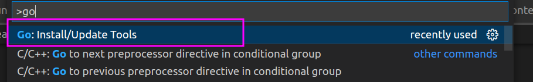
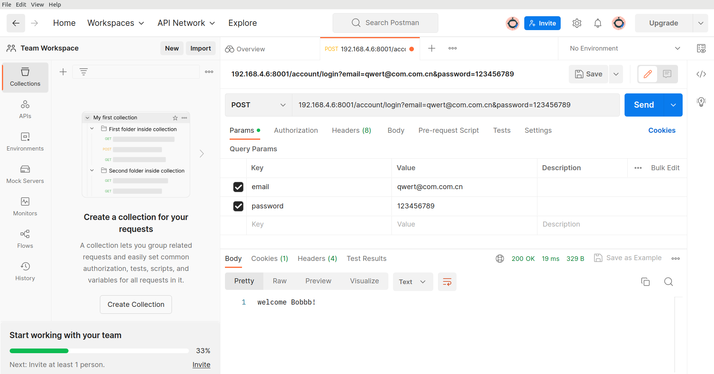

# Go Learning

## Install Go

```c
wget https://dl.google.com/go/go1.20.2.linux-amd64.tar.gz
tar -C /usr/local zxf go1.20.2.linux-amd64.tar.gz
export PATH=$PATH:/usr/local/go/bin
export GOPROXY=https://mirrors.aliyun.com/goproxy/
```

make sure the environment variables above are available in your terminal!

```c
mkdir go_test && cd go_test
go mod init example/hello
vim hello.go
```

write a hello world~

```c
package main

import "fmt"

func main() {
    fmt.Println("Hello, World!")
}
```

run it.

```c
go run hello.go
```

## VSCode

Install an extension called `Go`.

Press `Ctrl+Shift+P`, choose



## Docs

For gin, read the [offical docs](https://github.com/gin-gonic/gin/blob/master/docs/doc.md).

For mysql driver, we use [gorm](https://github.com/go-gorm/gorm) and this is the [tutorial](https://gorm.io/zh_CN/docs/index.html).

## Client

You can use `curl` to send request in the terminal. But curl doesn't handle cookies well.

```c
curl -X POST 'http://localhost:8001/account/create' -F "name=hanjl" -F "email=hanjiale@edun.com" -F "password=12356"
curl -X POST 'http://localhost:8001/account/login?email=qwert@com.com.cn&password=12356'
```

We recommend to install [Postman](https://www.postman.com/downloads/) on your ubuntu or windows.



## Authentication

We use [jwt](https://github.com/golang-jwt/jwt) and cookies.

Read the examples:

- [build a token](https://pkg.go.dev/github.com/golang-jwt/jwt/v5#example-New-Hmac)
- [validate a taken](https://pkg.go.dev/github.com/golang-jwt/jwt/v5#example-Parse-Hmac)
